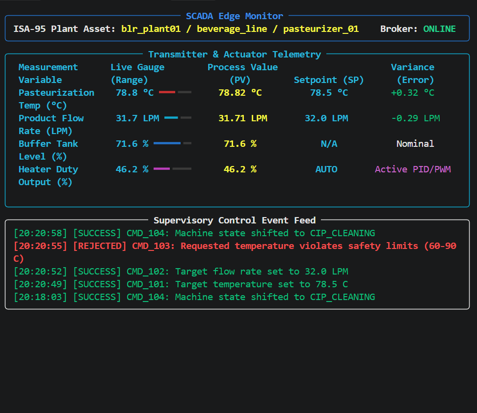

# Industrial IoT Telemetry & Supervisory Edge Pipeline (ISA-95)

An end-to-end industrial IoT telemetry and supervisory control pipeline modeling an industrial beverage pasteurizer. The system follows ISA-95 asset hierarchy standards, implements store-and-forward SQLite persistence, provides closed-loop remote setpoint control with safety interlocks, and renders a live terminal-based SCADA HMI.

## Architecture Overview

```text
[ Beverage Pasteurizer ]  (edge_publisher.py)
       │  (MQTT: Telemetry Stream)
       ├──► [ Live SCADA Dashboard ] (dashboard.py)
       │
       ├──► [ Local SQLite Store ] (edge_logger.py)
       │         │
       │         ▼ (Batch Sync / QoS 1)
       │    [ Cloud Forwarder ] (cloud_forwarder.py) ──► Enterprise Ingestion
       │
       ▲  (MQTT: Commands & Safety Interlocks)
       │
[ Supervisory Dispatcher ] (command_dispatcher.py)
```

## Key Features

- **ISA-95 Enterprise Hierarchy:** MQTT topics structured by enterprise/facility/area/line/asset (`factory/blr_plant01/beverage_line/pasteurizer_01`).
- **Edge Simulation with Physical Dynamics:** Simulates heat-exchange heating curves, fluid flow, and buffer tank levels.
- **Safety Interlocks & Rejection:** Verifies supervisory setpoint requests against operational limits (rejects temperatures outside 60°C–90°C) with Last Will and Testament (LWT) monitoring.
- **Resilient Store-and-Forward:** Local SQLite engine buffers process records on the edge to guarantee data survival across network disruptions.
- **Live Terminal SCADA HMI:** Built with Rich, featuring live bar gauges, PV vs. SP error tracking, and a supervisory audit log.
- **Batch Cloud Synchronization:** Periodically sweeps unsynced local rows and publishes payloads with MQTT QoS 1 before committing sync flags.

## Live SCADA Interface



## Project Structure

```text
food-machinery-telemetry/
│
├── config.py                 # Central ISA-95 topic schema and operational thresholds
├── edge_publisher.py         # Process simulation, telemetry publisher & command handler
├── edge_logger.py            # Store-and-forward local SQLite persistence engine
├── command_dispatcher.py     # Synchronized supervisory recipe controller
├── dashboard.py              # Live Rich terminal SCADA monitor
├── cloud_forwarder.py        # Edge-to-cloud batch synchronizer
├── data/
│   └── telemetry.db          # Local SQLite storage
├── docs/
│   └── images/
│       └── scada_dashboard.png
├── .gitignore
├── README.md
└── requirements.txt
```

## Getting Started

### 1. Environment Setup

```powershell
python -m venv venv
.\venv\Scripts\Activate.ps1
pip install -r requirements.txt
```

### 2. Execution Order

Run each script in its own terminal window (with the virtual environment activated):

```powershell
python edge_publisher.py
python edge_logger.py
python dashboard.py
python command_dispatcher.py
python cloud_forwarder.py
```
